<div align="center">

# ⛓ ChainSentinel

**Real-time EVM wallet, token-approval, and smart-contract event monitoring — with alerts, signed webhooks, and multi-chain support.**

[](https://github.com/Eazydev-CEO/chainsentinel/actions/workflows/ci.yml)
[](LICENSE)


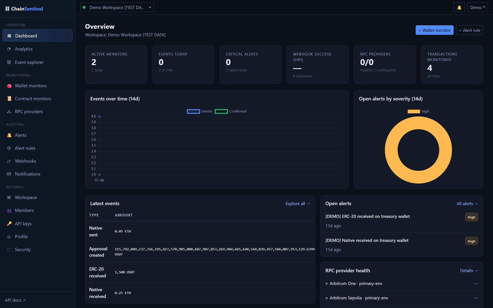

*Multi-tenant monitoring operations room: live metrics, decoded events, alert severity breakdowns and RPC provider health — every number backed by real database records.*

</div>

---

ChainSentinel watches wallets and smart contracts on **Ethereum, BNB Smart Chain, Polygon, Base, Arbitrum and Optimism** (testnets first-class). A Celery-powered engine ingests blocks in order, deduplicates every event with database-enforced idempotency keys, tracks confirmation depth, survives chain reorganizations, and fans alerts out to dashboards, email and HMAC-signed webhooks. Built as a production-grade multi-tenant SaaS — not a demo.

## ✨ Features

**Monitoring**
- 👛 **Wallet monitors** — native, ERC-20 and NFT (ERC-721) transfers with direction, token and minimum-value filters; EIP-55 validation and per-workspace duplicate prevention
- 🛡 **Approval security** — detect approvals created / changed / revoked and `ApprovalForAll` operator grants — the events drain attacks rely on
- 🐋 **Large-movement thresholds** — flag threshold-breaking transfers and auto-escalate their severity
- 📜 **Contract monitors** — paste any ABI: events are extracted, signature/topic0 hashes generated, logs decoded, indexed-parameter filters applied; malformed data never crashes ingestion (raw logs preserved with the decode error)
- 📥 **CSV import/export** for wallet monitors with row-level validation reports

**Engine**
- ⚙️ Ordered block processing under per-chain distributed locks — horizontally scalable workers with zero duplicate processing
- 🧾 **Idempotent everything** — events, alerts, notifications and webhook deliveries all carry unique dedupe keys enforced by the database
- ⛓ **Reorg-aware** — a rolling block-hash ring detects forks, reverts orphaned events, records the incident and reprocesses from the fork point
- ✅ **Confirmation tracking** — events stay `PENDING` until their per-monitor confirmation depth is reached
- 🔁 **RPC failover** — prioritized providers, per-minute health probes, exponential backoff, rate-limit awareness and automatic recovery

**Alerting & delivery**
- 🚨 Rule engine with filters on monitor, chain, event type, token, amount range, addresses and topic — plus cooldowns, debounce and burst-grouping with occurrence counters
- 🔔 In-app notifications with per-user severity preferences; email for critical alerts, failed webhooks, provider outages and daily digests
- ⇄ **Webhooks** signed with HMAC SHA-256 (`t=…,v1=…` + timestamp header), SSRF-guarded egress, persistent exponential retries, full delivery history and one-click replay

**Platform**
- 👥 Multi-tenant workspaces with Owner / Admin / Analyst / Viewer roles and strict object-level isolation
- 🔑 Scoped API keys (read / write), SHA-256 hashed, shown exactly once
- 📊 Analytics from real aggregates: events by chain, alerts by severity, top wallets, webhook delivery trends
- 🧭 Versioned REST API with OpenAPI schema + Swagger UI, consistent error envelope, throttling
- 🗂 Full audit log of security-relevant actions, surfaced to workspace admins

## 🖼 Screenshots

*Dark theme (a light theme is on the [roadmap](#-roadmap)).*

| | |
|:---:|:---:|
| **Landing page** 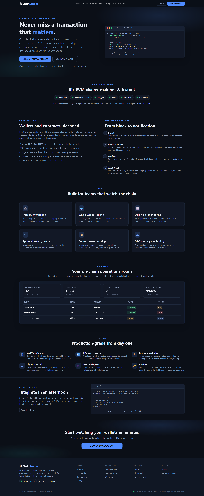 | **Event explorer** 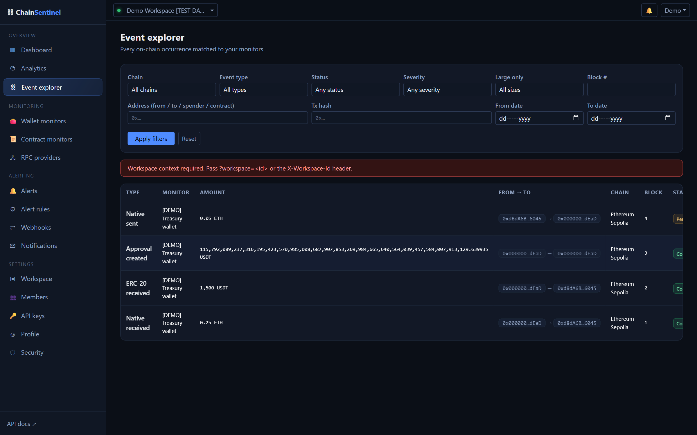 |
| **Analytics** 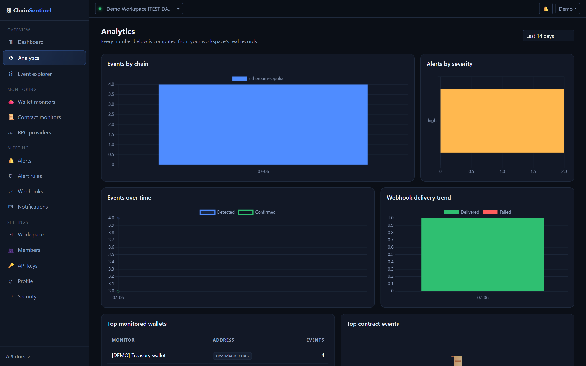 | **Wallet monitors** 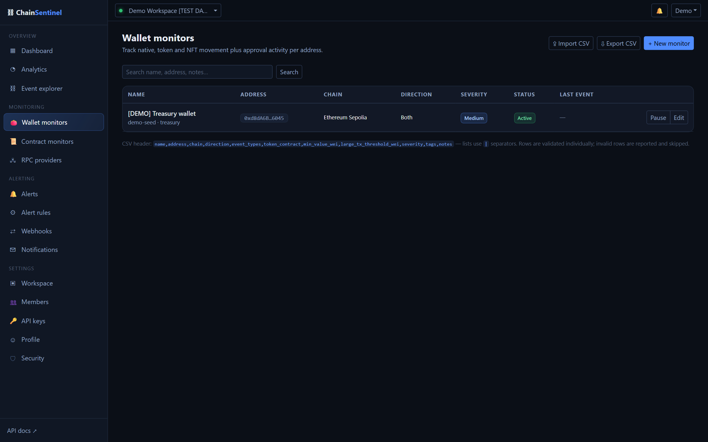 |
| **Contract monitors** 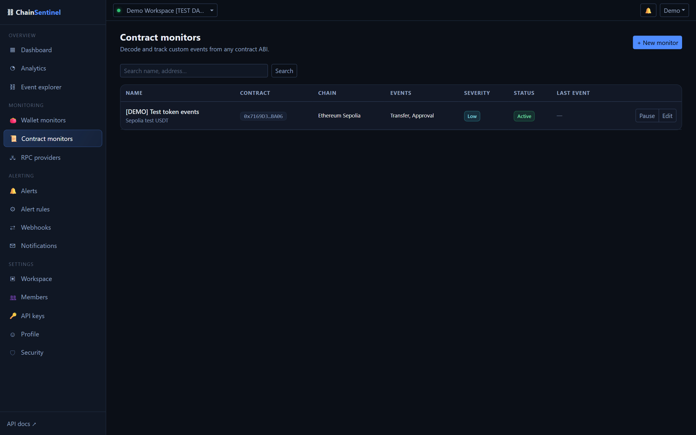 | **Alerts** 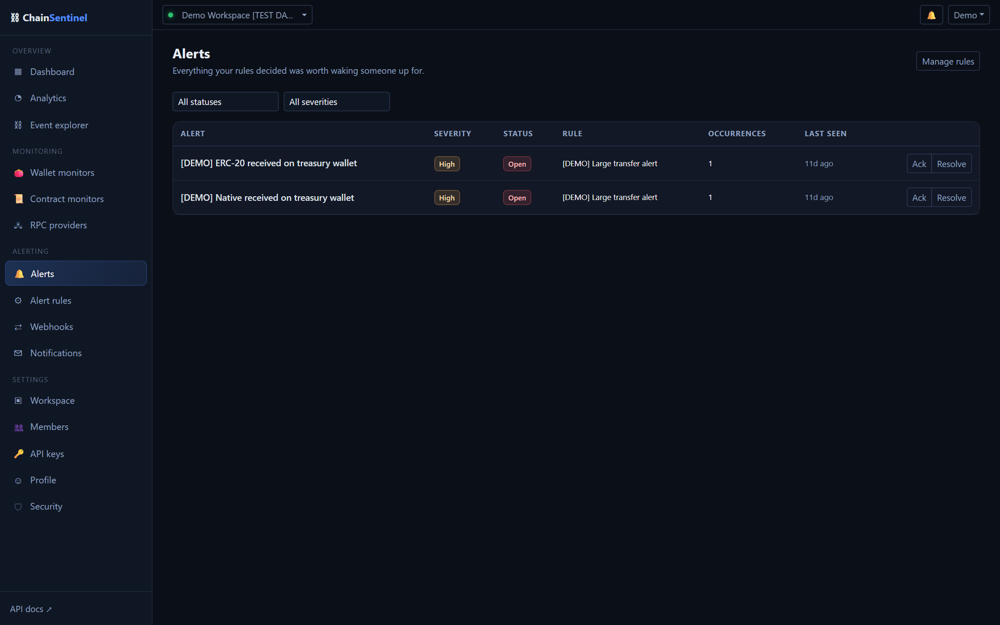 |
| **Webhooks** 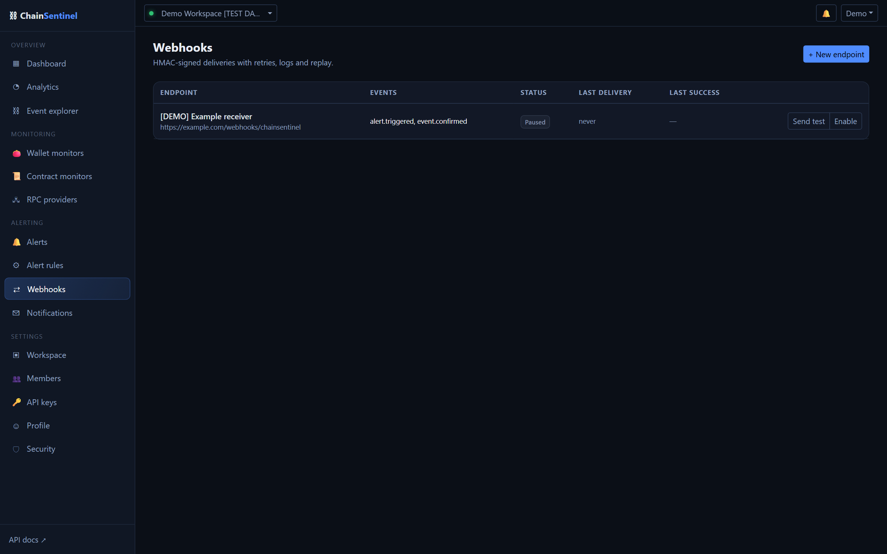 | **Sign in** 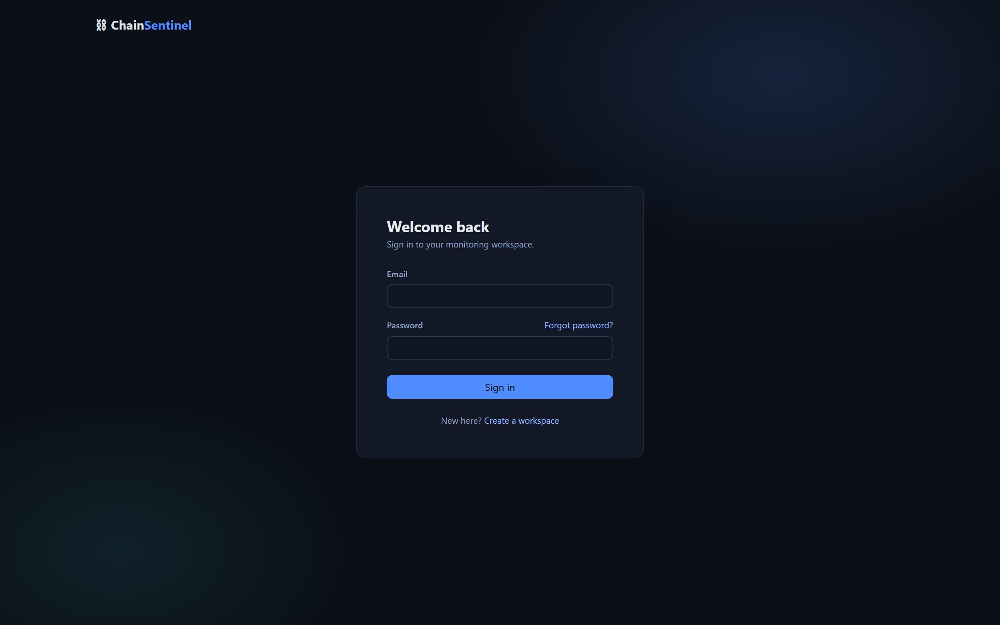 |

<details>
<summary>More: registration & settings</summary>

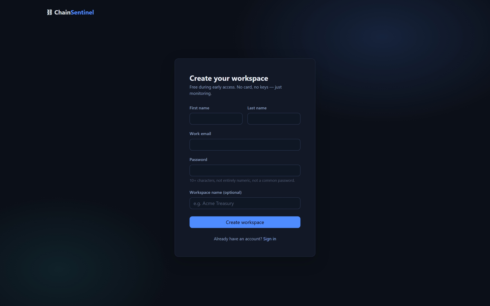
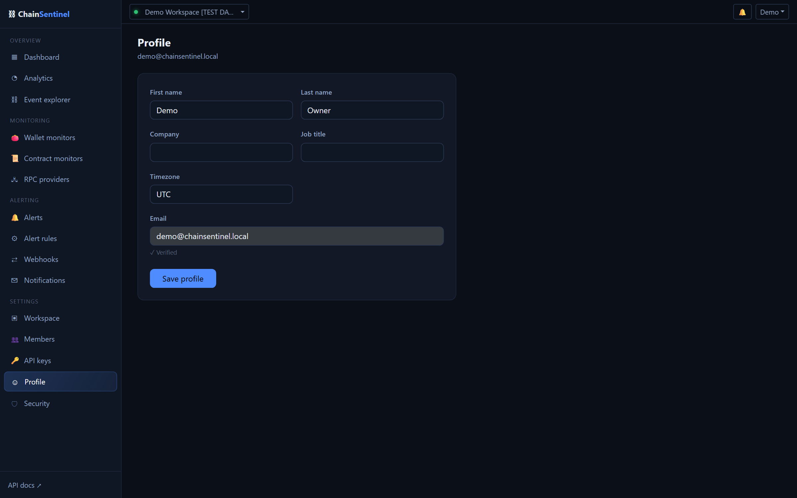

</details>

## 🧱 Tech stack

| Layer | Technology |
|-------|------------|
| Frontend | Next.js 15 (App Router) · TypeScript · Bootstrap 5 · SCSS design tokens · React Hook Form + Zod · Chart.js |
| Backend | Python 3.12+ · Django 5.2 · Django REST Framework · SimpleJWT (HttpOnly cookies) · drf-spectacular |
| Workers | Celery + Celery Beat · Web3.py · Redis broker |
| Data | PostgreSQL (single source of truth) · Redis (cache, queues, locks, throttles only) |
| Infra | Docker Compose (7 services) · Nginx · Gunicorn · Next standalone output |

## 🏗 Architecture

```
Browser ──► Nginx (prod) ──► Next.js  (public site + dashboard SPA — never touches the DB)
                      └────► Django + DRF  (/api/v1 — auth, tenancy, config, storage)
                                   │
                                   ├── PostgreSQL   ← source of truth
                                   ├── Redis        ← cache · locks · throttles · Celery broker
                                   └── Celery workers + Beat
                                        ├─ poll blocks (per-chain lock, ordered, checkpointed)
                                        ├─ decode & dedupe events (unique idempotency keys)
                                        ├─ confirmations + reorg revert/rewind/reprocess
                                        ├─ alert rules → notifications / email
                                        └─ HMAC-signed webhook delivery (+ retries, replay)
                                                 │
                                                 ▼
                              EVM chains via prioritized failover RPC providers
```

Key decisions — per-event confirmation snapshots, block-hash ring reorg detection, DB-enforced idempotency, SSRF-guarded webhook egress, cookie-JWT auth with CSRF — are documented with rationale in [docs/ARCHITECTURE.md](docs/ARCHITECTURE.md) and [PROJECT_FLOW/PROJECTFLOW.md](PROJECT_FLOW/PROJECTFLOW.md).

## 🚀 Getting started

### Docker (recommended)

```bash
git clone https://github.com/Eazydev-CEO/chainsentinel.git
cd chainsentinel
cp .env.example .env        # placeholders boot fine for a first run
docker compose up --build
```

| Service | URL |
|---------|-----|
| Frontend | http://localhost:3026 |
| REST API | http://localhost:8212/api/v1/ |
| Swagger UI | http://localhost:8212/api/v1/docs/ |
| Django admin | http://localhost:8212/admin/ |

Seed demo data (chains, a demo workspace, clearly-labelled sample records):

```bash
docker compose exec backend python manage.py seed_dev
docker compose exec backend python manage.py createsuperuser   # for /admin
```

Sign in with `demo@chainsentinel.local` / `DemoPass123!` (configurable via `SEED_DEMO_PASSWORD`).

To ingest real blocks, add a **testnet** RPC URL to `.env` (e.g. `RPC_ETHEREUM_SEPOLIA_HTTP=https://…` from any free provider tier) and re-run `seed_dev`. Mainnet chains are seeded **inactive** by design.

### Local development (bare metal)

```bash
# Backend — Python 3.12+, PostgreSQL & Redis running locally
cd backend
python -m venv .venv && . .venv/bin/activate    # Windows: .venv\Scripts\activate
pip install -r requirements/development.txt
python manage.py migrate && python manage.py seed_dev
python manage.py runserver 8212

# Workers (separate shells)
celery -A config worker -l info -Q default,engine,delivery
celery -A config beat -l info

# Frontend
cd frontend && npm install && npm run dev       # http://localhost:3026, /api proxied to :8212
```

## 🔧 Environment variables

Copy [`.env.example`](.env.example) → `.env`. Highlights (full reference: [docs/ENVIRONMENT.md](docs/ENVIRONMENT.md)):

| Variable | Purpose |
|----------|---------|
| `DJANGO_SECRET_KEY` | Django signing key — long & random in production (boot fails otherwise) |
| `POSTGRES_*` / `REDIS_URL` | Data stores |
| `RPC_<CHAIN>_HTTP` | Per-chain RPC endpoints — testnets for local dev, blank keeps the provider inactive |
| `WEBHOOK_ENCRYPTION_KEY` | Fernet key encrypting webhook secrets at rest (required in production) |
| `SMTP_*` | Email delivery — console backend in dev when unset |
| `ENGINE_*` / `RETENTION_*` | Poll cadence, batch size, data-retention windows |

Secrets live in the environment only — nothing is hardcoded, and `.env` is git-ignored.

## 📡 API overview

Versioned REST API under `/api/v1/` with interactive documentation at `/api/v1/docs/` (Swagger UI / OpenAPI via drf-spectacular).

- **Auth**: HttpOnly-cookie JWT sessions (browser) with CSRF protection and refresh rotation, or workspace-scoped API keys via `X-Api-Key` for integrations
- **Resources**: `auth` · `workspaces` · `members` · `chains` · `provider-health` · `wallet-monitors` · `contract-monitors` · `events` · `alerts` · `alert-rules` · `webhooks` · `webhook-deliveries` · `notifications` · `api-keys` · `audit-logs` · `analytics`
- **Conventions**: pagination, filtering, search and ordering on list endpoints; scoped throttles; a consistent error envelope `{"error": {"code", "message", "details"}}`

```bash
curl -H "X-Api-Key: cs_xxxxxxxx_..." \
  "http://localhost:8212/api/v1/events/?chain=ethereum-sepolia&event_type=approval_created"
```

Guide with examples: [docs/API.md](docs/API.md) · Webhook payloads & signature verification: [docs/WEBHOOKS.md](docs/WEBHOOKS.md)

## 🔐 Security notes

Read-only by design — **no private keys are ever stored and no transactions are ever sent**.

- HttpOnly-cookie JWTs with refresh rotation + blacklist; CSRF enforced on cookie-authenticated writes; per-device session management
- Strict multi-tenant isolation — every workspace-scoped query passes membership + role checks; cross-tenant IDs 404
- API keys hashed (SHA-256), constant-time compared, scope-limited, revocable
- Webhook egress SSRF protection: scheme/port allowlists, DNS resolution checks, private/metadata IP blocking, no redirect following — validated at save **and** send time
- Webhook secrets Fernet-encrypted at rest and shown exactly once; HMAC SHA-256 payload signing with timestamp headers
- Rate limiting at nginx and DRF layers; login/reset/registration throttles; secrets redacted from logs and audit metadata
- Security headers (CSP, HSTS-ready, frame-deny) at nginx, Django and Next layers

Full threat model and control inventory: [docs/SECURITY.md](docs/SECURITY.md)

## 🧪 Testing

```bash
cd backend && pytest            # 175 tests, ~4s — Web3 fully mocked, zero network
cd frontend && npm run build    # strict type-check + production build
```

The suite covers the engine (dedupe across crash-rewind, confirmations, reorg revert/reprocess), RPC failover and backoff, alert cooldown/debounce/grouping, webhook HMAC + SSRF matrix + retry schedules, workspace permission matrices, API-key scopes, CSV import validation and the full cookie/CSRF auth flow. Details: [docs/TESTING.md](docs/TESTING.md). CI runs both suites on every push.

## 📁 Project structure

```
├── frontend/               Next.js app (App Router)
│   ├── app/                (public) site · (auth) flows · app/ dashboard
│   ├── components/         UI kit, charts, forms, dialogs
│   ├── lib/                API client, auth/workspace contexts, formatting
│   ├── services/           typed API call layer
│   └── types/              shared API types
├── backend/                Django project
│   ├── config/             settings (base/dev/prod/test), Celery app, URLs
│   ├── apps/               accounts · workspaces · chains · monitors · events
│   │                       alerts · webhooks · notifications · audit · api
│   └── tests/              pytest suite with in-memory Web3 fakes
├── docker/                 nginx config, entrypoints
├── docs/                   architecture, API, security, ops documentation
├── docker-compose.yml      development stack (7 services)
└── docker-compose.production.yml
```

## 🗺 Roadmap

- [ ] Light theme
- [ ] Billing integration (plans are already modelled)
- [ ] Telegram & Slack alert channels (placeholders wired in the rule engine)
- [ ] WebSocket `newHeads` fast-path enabled by default
- [ ] ERC-1155 support and NFT metadata enrichment
- [ ] Anomaly scoring on approval patterns
- [ ] Public status page per workspace

## 📚 Documentation

| Doc | Contents |
|-----|----------|
| [docs/ARCHITECTURE.md](docs/ARCHITECTURE.md) | System design, engine pipeline, failover, reorg handling |
| [docs/DATABASE.md](docs/DATABASE.md) | Every model, constraint and index |
| [docs/API.md](docs/API.md) | REST API guide, auth, examples |
| [docs/WEBHOOKS.md](docs/WEBHOOKS.md) | Payloads, signature verification, retries |
| [docs/SECURITY.md](docs/SECURITY.md) | Threat model and implemented controls |
| [docs/ENVIRONMENT.md](docs/ENVIRONMENT.md) | Every environment variable |
| [docs/DEPLOYMENT.md](docs/DEPLOYMENT.md) | Production deployment, TLS, backups |
| [docs/TESTING.md](docs/TESTING.md) | Suite layout and how to extend it |
| [docs/RUNBOOK.md](docs/RUNBOOK.md) | Incident response and operations |
| [docs/SUPPORTED_CHAINS.md](docs/SUPPORTED_CHAINS.md) | Chain matrix, adding chains/providers |
| [CONTRIBUTING.md](CONTRIBUTING.md) | Engineering rules and conventions |
| [PROJECT_FLOW/PROJECTFLOW.md](PROJECT_FLOW/PROJECTFLOW.md) | Build log and design-decision record |

## 📄 License

Released under the [MIT License](LICENSE).

## 👤 Author

**Ezekiel Obiajulu** — [@Eazydev-CEO](https://github.com/Eazydev-CEO)

Full-stack engineer focused on backend systems, blockchain infrastructure and automation.
If this project is useful to you, a ⭐ is appreciated.
